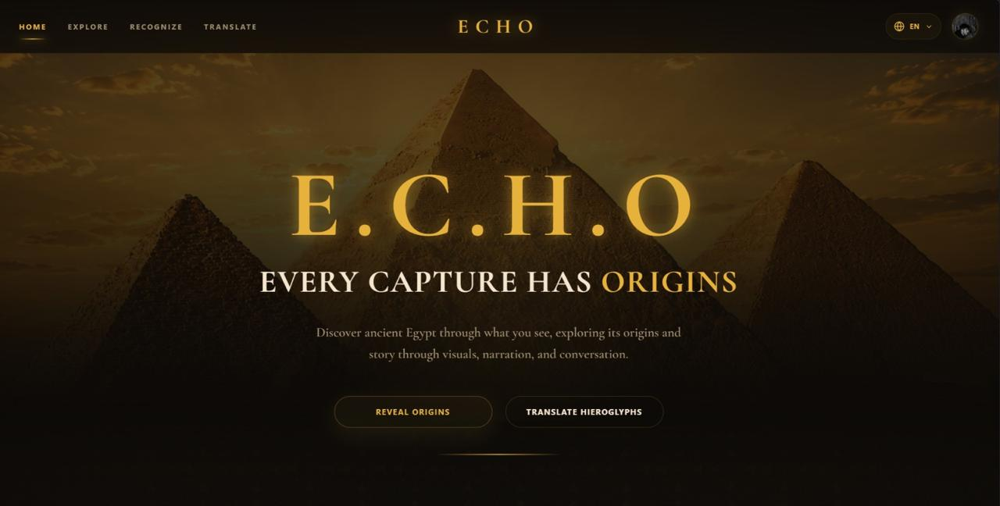

# Hi, I'm Malak Diab

Artificial Intelligence-focused Computer Science graduate, ranked 1st in the AI Department with a GPA of 3.98/4.0, holding a dual bachelor's degree from **Ain Shams University** and the **University of East London**. I am passionate about building end-to-end AI systems that combine **Machine Learning, Computer Vision, Generative AI, and Retrieval-Augmented Generation (RAG)** to solve real-world problems.

I'm currently seeking opportunities as an **AI Engineer** or **Machine Learning Engineer**.

## Featured Project

  

### E.C.H.O. — Every Capture Has Origins
*A multimodal AI platform for the interactive exploration of Ancient Egypt.*

The platform integrates four AI modules into a single web application:

- Historical Figure & Landmark Recognition
- Agentic RAG Conversational Assistant
- AI Educational Video Generation
- Hieroglyph Translation

**Highlights**
- 98% historical figure recognition accuracy
- 90.9% landmark recognition accuracy
- 0.926 MRR Agentic RAG 
- A+ Graduation Project
- Selected for the Faculty Graduation Projects Expo

**Tech Stack**

Python · FastAPI · React · Docker · PostgreSQL · pgVector · TensorFlow · LangChain · Qwen · Llama · Edge-TTS

---

## Other Projects

### Food Recognition & Calorie Estimation

A multi-stage computer vision pipeline for food recognition, segmentation, one-shot learning, and calorie estimation.

**Highlights**

- YOLO
- EfficientNet
- Siamese Networks
- 🥇 1st Place — Computer Vision Competition

---

### Adult Census Income Classification

Machine learning application comparing multiple supervised learning algorithms.

**Highlights**

- Logistic Regression
- SVM
- Decision Trees
- KNN
- Fairness Analysis
- 🥈 2nd Place — Machine Learning Competition

---

## Technical Skills

**Languages:** Python, SQL, C++  
**AI/ML:** TensorFlow, Keras, Scikit-learn, OpenCV, Pandas, NumPy  
**Generative AI:** LLMs, RAG, LangChain  
**Backend & Deployment:** PostgreSQL, pgVector, FastAPI, Docker 
**Tools:** Git, Power BI, Oracle APEX

## Connect with me

- LinkedIn: [malak-diab](https://www.linkedin.com/in/malak-diab)
- Email: malak.amir.diab.0901@gmail.com
